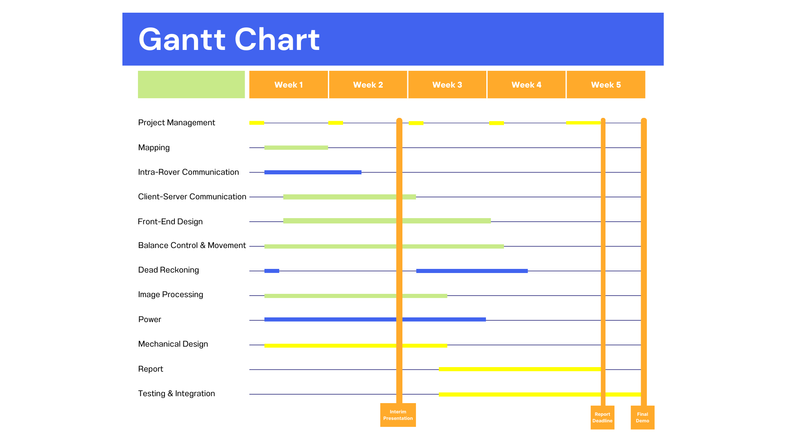

# EEEBalanceBug

### Useful links:
* [Main github](https://github.com/hakanmerdan/EEEBalanceBug)
* [When2Meet](https://www.when2meet.com/?20113161-Gyo7p)
* [Groups spreadsheet](https://imperiallondon-my.sharepoint.com/:x:/g/personal/hm4417_ic_ac_uk/EUaUsJREKT1OjnP64Lxzzj0B8Ukt0M3FKwPdenaBU0SBVA?e=ntA0z6)
* [OneNote](https://imperiallondon-my.sharepoint.com/personal/ac2021_ic_ac_uk/_layouts/OneNote.aspx?id=%2Fpersonal%2Fac2021_ic_ac_uk%2FDocuments%2FNotebooks%2F%5BYEAR%202%5D%20Design%20Project)
* [FPGA camera documentation](https://github.com/edstott/EEE2Rover)
* [Book appointment](https://outlook.office365.com/owa/calendar/EEEStudentStaffMeetings@ImperialLondon.onmicrosoft.com/bookings/s/4LzT3SYhjUyp3ds6tcLOAg2)
* [Report](https://www.overleaf.com/3493489674mcnqckgxrqzh)
* [Ed Stem](https://edstem.org/us/courses/39835/discussion/3139049)
* [Interim Report](https://imperiallondon-my.sharepoint.com/personal/ag1421_ic_ac_uk/_layouts/15/doc.aspx?sourcedoc={171a1bc9-ff15-4e1a-bf86-3ad2c7291123}&action=edit)
* [Report Document](https://imperiallondon-my.sharepoint.com/:w:/g/personal/ac2021_ic_ac_uk/EfYSGsEUYoNOriElocN41cUBBebUKeO8zwkJNSMaI5s-Yg)

### Gantt Chart

